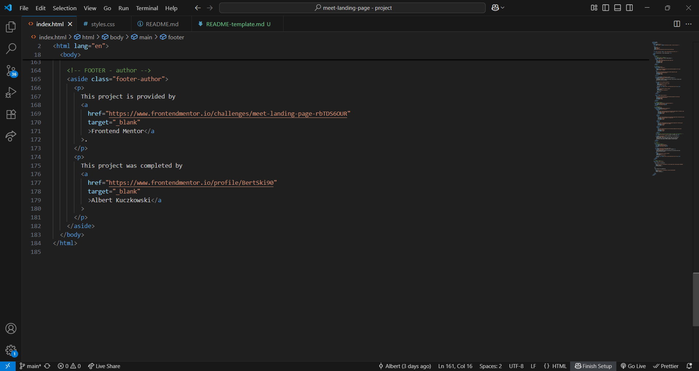

# Frontend Mentor - Meet landing page solution

This is a solution to the [Meet landing page challenge on Frontend Mentor](https://www.frontendmentor.io/challenges/meet-landing-page-rbTDS6OUR). Frontend Mentor challenges help you improve your coding skills by building realistic projects.

## Table of contents

- [Overview](#overview)
  - [The challenge](#the-challenge)
  - [Screenshot](#screenshot)
  - [Links](#links)
- [My process](#my-process)
  - [Built with](#built-with)
  - [What I learned](#what-i-learned)
  - [Continued development](#continued-development)
  - [Useful resources](#useful-resources)
- [Author](#author)
- [Acknowledgments](#acknowledgments)

**Note: Delete this note and update the table of contents based on what sections you keep.**

## Overview

### The challenge

Users should be able to:

- View the optimal layout depending on their device's screen size
- See hover states for interactive elements

### Screenshot

HTML




CSS


### Links

- Solution URL: [Github @BertSki90](https://github.com/BertSki90/meet-landing-page)
- Live Site URL: [Github @BertSki90](https://bertski90.github.io/meet-landing-page/)

## My process

### Built with

- Semantic HTML5 markup
- CSS custom properties
- Flexbox
- Mobile-first workflow

### What I learned

I learned how to add a tint to and image without tinting the text and everything else on top of the tint. I added the opacity to the color variable with rgba(). If opacity was added to the element instead then all the text on top of it also inherited the opacity making it harder to read. See below:

```html
<!-- FOOTER -->
<footer>
  <!-- NUMBERED DIVIDER -->
  <figure class="numbered-divider">
    <div class="vertical-line"></div>
    <h6 class="text-preset-5">02</h6>
  </figure>

  <div class="cyan-picture-cover footer-flex">
    <h3 class="text-preset-2">Experience more together</h3>
    <p class="text-preset-4">
      Stay connected with reliable HD meetings and unlimited one-on-one and
      group video sessions.
    </p>
    <button class="text-preset-5 button__purple" type="button">
      Download <span class="button__purple-download-version">v1.3</span>
    </button>
  </div>
</footer>
```

```css
/* |||| ROOT |||| */

:root {
  /* COLORS */
  --cyan__300: rgb(143, 227, 249);
  --cyan__600: rgb(77, 150, 168);
  /* v here is where I added opacity to the color. v */
  --cyan__600__cover: rgba(77, 150, 168, 0.9);
  /* ... followed by more code ... */
}

/* |||| FOOTER |||| */

footer {
  /* v Setting up the image in the background. v */
  background-image: url("./assets/mobile/image-footer.jpg");
  background-position: center;
  background-repeat: no-repeat;
  background-size: cover;
  margin-block-start: 6.75em;
  z-index: 5;
}

footer > .numbered-divider {
  margin-block-start: -6.875em;
  position: absolute;
}

footer > picture {
  position: relative;
  max-width: 100%;
}

/* v Setting up the cyan tint over the background image. The color is set up with as and rgba to have opacity. v  */
.cyan-picture-cover {
  background-color: var(--cyan__600__cover);
}
```

### Continued development

Completion time: 17:26

The last few projects I have been using rem, em, and ch units for spacing and max-width on elements. This is the first time I utilized the clamp() function to add more responsiveness to my projects. I feel more confident with arranging and spacing the elements. I feel most unsure about the footer's background with cyan tint and that more practice with images and more specifically, background images, will be excellent practice.

### Useful resources

- [FreeCodeCamp](https://www.freecodecamp.org/news/transparent-background-image-opacity-in-css-and-html/) - Breif article about placing images in the background and how setting to opacity effects the children elements.

## Author

- Github Profile - [@BertSki90](https://github.com/BertSki90)
- Frontend Mentor - [@BertSki90](https://www.frontendmentor.io/profile/BertSki90)
- X - [@BertSki90](https://x.com/BertSki90)

## Acknowledgments

Thank you to Frontend Mentor and FreeCodeCamp. I am provided with a lot of content to learn to code and receive valuable feedback from the community. I appreciate this!
